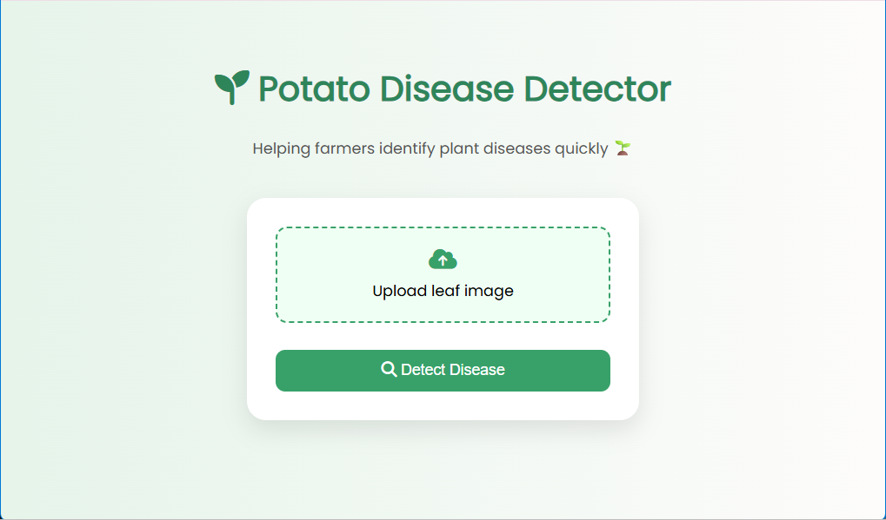
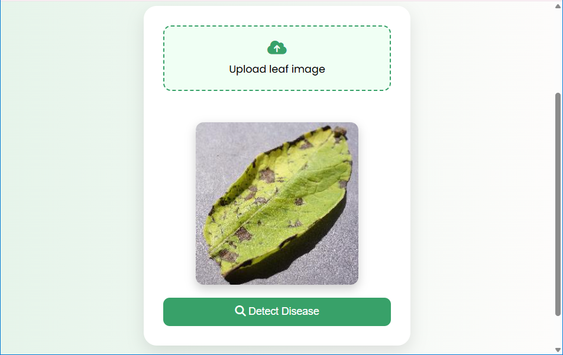
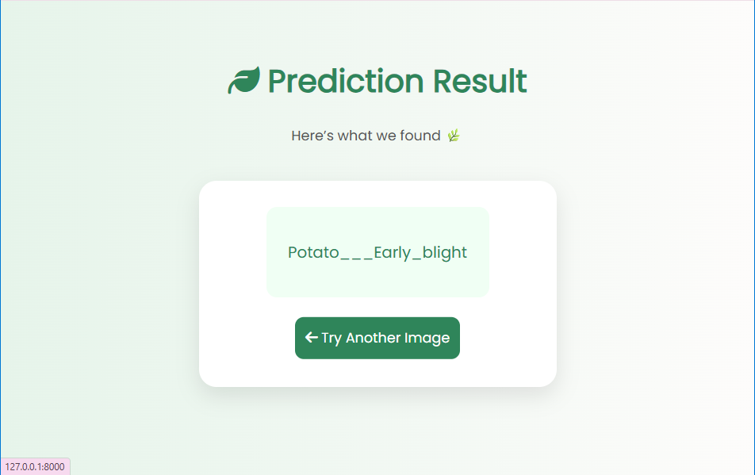

# 🌿 Potato Disease Detection Web App

An AI-powered web application that detects potato leaf diseases using deep learning.  
Built with Django and TensorFlow, this project helps identify plant diseases quickly and efficiently.

---

## 📌 Overview

This project allows users to upload an image of a potato leaf and get an instant prediction of whether the leaf is:

- 🟢 Healthy
- 🍂 Early Blight
- 🌧 Late Blight

It combines a deep learning model with a simple and user-friendly web interface.

---

## ✨ Features

- 📤 Upload potato leaf images
- 🖼 Image preview before prediction
- 🤖 AI-based disease classification
- 🎨 Color-based result display (Healthy / Diseased)
- ⏳ Loading animation for better user experience
- ⚠️ Input validation (alert if no image uploaded)

---

## 🛠 Tech Stack

- **Frontend:** HTML, CSS, JavaScript  
- **Backend:** Django  
- **Machine Learning:** TensorFlow / Keras  
- **Deployment:** Render (in progress)

---

## 🧠 Model Details

- Built using Convolutional Neural Network (CNN)
- Trained on potato leaf dataset
- Outputs prediction with confidence score

---

## 📂 Project Structure
```text
potato-disease-project/
│
├── app/
│ ├── templates/
│ │ ├── index.html
│ │ └── result.html
│ │
│ ├── static/
│ │ ├── css/
│ │ └── js/
│ │
│ ├── views.py
│ └── model/
│
├── manage.py
├── requirements.txt
└── README.md
```

---

## ⚙️ Run Locally

### 1. Clone the repository

```bash
git clone https://github.com/ShrutiDesai243/potato-disease-classifier.git
cd potato-disease-classifier
```

### 2. Create virtual environment
```bash
python -m venv env
env\Scripts\activate   # Windows
```
### 3. Install dependencies
```bash
pip install -r requirements.txt
```
### 4. Run server
```bash
python manage.py runserver
```
### 5. Open in browser
http://127.0.0.1:8000/

## 🌐 Live Demo
Deployment in progress (working on improving stability due to model size)

## 📸 Screenshots

### 🏠 Home Page


### 🖼 Image Preview


### 📊 Prediction Result

